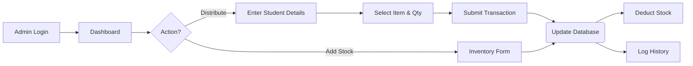

# Sunshine Inventory Project - Presentation Content

Use this document to create your PowerPoint presentation.

---

## Slide 1: ER Model / Diagram
**Content**:
- Insert the image located at: `f:\mca\sunshinemob\er_diagram.png`
- **Title**: Entity Relationship Diagram (ERD)

---

## Slide 2: ER Model Explanation
**Title**: Database Schema Overview

**Content**:
The database consists of three main entities designed to track users, stock, and distribution history.

1.  **Users Table**
    - **Purpose**: Manages authentication and access control.
    - **Attributes**: `id` (PK), `username`, `password` (Hashed), `role` (Admin/User).
    - **Key Feature**: Stores secure, hashed passwords for security.

2.  **Inventory Table**
    - **Purpose**: Stores the current stock levels of all items.
    - **Attributes**: `id` (PK), `name`, `category` (Uniform, Kit, etc.), `size` (S/M/L), `quantity`, `price`.
    - **Key Feature**: Categorizes items and tracks size logic (required for uniforms).

---

## Slide 3: ER Model Explanation (Continued)
**Title**: Relationships & Transaction Logic

**Content**:
3.  **Transactions Table**
    - **Purpose**: logs every distribution event to a student.
    - **Attributes**: `id` (PK), `student_name`, `student_class`, `item_id` (FK), `quantity`, `date`.
    - **Relationship**: linked to `Inventory` via `item_id`.

**Relationships**:
- **One-to-Many**: One Inventory Item `(Inventory.id)` can have multiple Transaction records `(Transactions.item_id)`.
- This allows the system to calculate stock deductions dynamically and keep a permanent history of who received what.

---

## Slide 4: Technology Stack
**Title**: Programming Languages & Database

**Content**:
- **Logos**: (Add logos for JavaScript, Node.js, React, SQLite)

**Core Languages**:
- **JavaScript (ES6+)**: Used for both Frontend and Backend (Full Stack).
- **SQL**: Used for database queries and management.
- **HTML5 / CSS3**: For structure and styling.

**Database: SQLite**
- **Why Chosen?**
    - **Serverless**: No separate server process needs to be installed; it runs directly from a file (`inventory.db`).
    - **Zero Configuration**: Easy to set up and move (portable).
    - **Reliability**: ACID compliant and standard SQL support.
    - **Efficiency**: Perfect for local/embedded applications where setting up a massive Postgres/MySQL server is overkill.

---

## Slide 5: Frameworks & Libraries
**Title**: Frameworks & Tools

**Content**:
1.  **Frontend: React + Vite**
    - **React**: Component-based architecture makes the UI modular and reusable.
    - **Vite**: Modern build tool that provides instant server start and fast hot module replacement (HMR).
    - **Axios**: For making HTTP requests to the backend.

2.  **Backend: Node.js + Express**
    - **Node.js**: Runtime environment to execute JavaScript on the server.
    - **Express**: Minimalist web framework to handle API routes (GET, POST) efficiently.
    - **SQLite3**: Driver to interact with the database file.

---

## Slide 6: Project Objectives
**Title**: Project Objectives

**Content**:
- **Digitize Inventory**: Move away from paper-based tracking to a digital system.
- **Automate Distribution**: Streamline the process of handing out kits and uniforms to students.
- **Real-Time Tracking**: Automatically update stock levels instantly when an item is distributed.
- **Record Keeping**: Maintain a searchable history of which student received which item and when.
- **Prevent Errors**: Reduce human error in stock counting and student data entry.

---

## Slide 7: Problem Statement
**Title**: Problem Statement

**Content**:
- **Manual Inefficiency**: Previous paper records were slow to update and hard to search.
- **Stock Discrepancies**: Physical stock often didn't match records due to unlogged items.
- **Lack of History**: Difficult to verify past distributions (e.g., "Did Student A already get a kit?").
- **Reporting**: Generating reports on total distributions or remaining stock was time-consuming and manual.

---

## Slide 8: System Flow Chart
**Title**: System Flow Diagram

**Content**:
*(You can create a diagram with these steps or screenshot the textual flow below)*

**Flow Explanation**:
1.  User logs in.
2.  Chooses to Distribute Items or Add Stock.
3.  System processes the request and updates the SQLite Database.
4.  Confirmation is sent back to the UI.

---

## Slide 9: Tools Used
**Title**: Tools & Environment

**Content**:
- **VS Code**: Primary Code Editor.
- **Postman**: For testing API endpoints (Backend testing).
- **Git & GitHub**: Version control and code repository.
- **Node Package Manager (NPM)**: Dependency management.
- **Browser DevTools**: For debugging the Frontend UI.
- **Command Line / Terminal**: For running the servers.

---

## Slide 10: Project Setup Steps
**Title**: How to Run the Project

**Content**:
**Step 1: Backend Setup**
1.  Open Terminal.
2.  `cd server`
3.  `npm install`
4.  `node server.js` (Runs on Port 3000)

**Step 2: Frontend Setup**
1.  Open New Terminal.
2.  `cd client_v2`
3.  `npm install`
4.  `npm run dev` (Runs on Port 5173)

**Step 3: Access**
- Open Browser to `http://localhost:5173`
